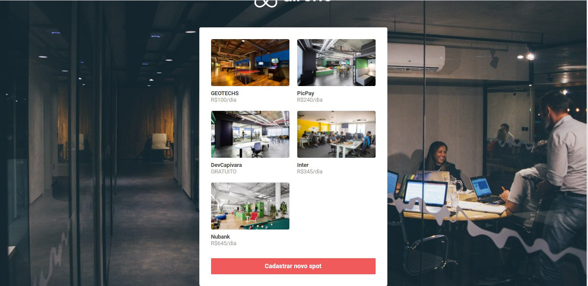
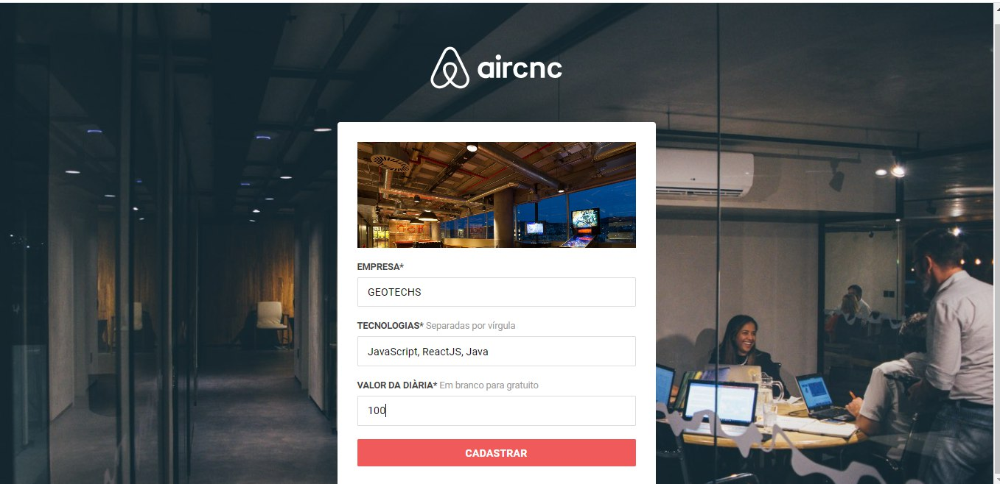
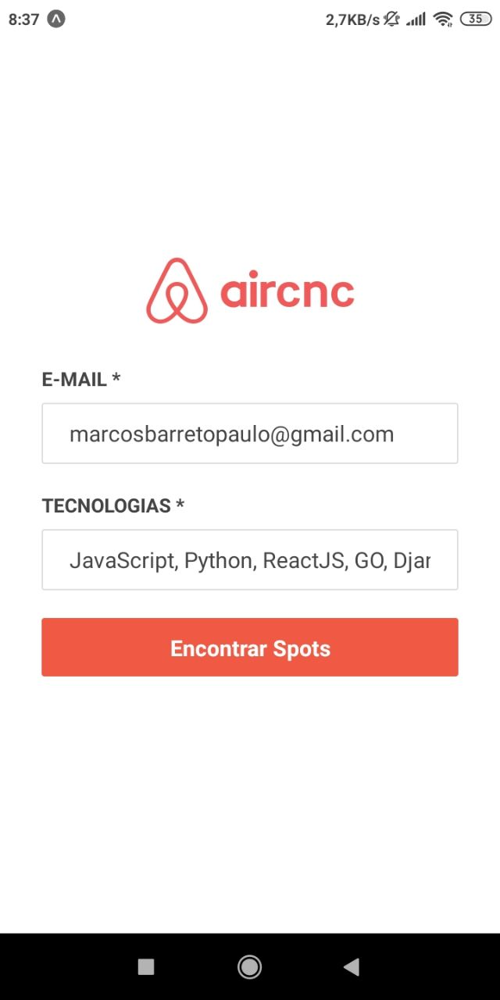
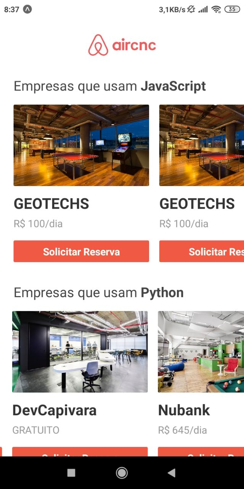
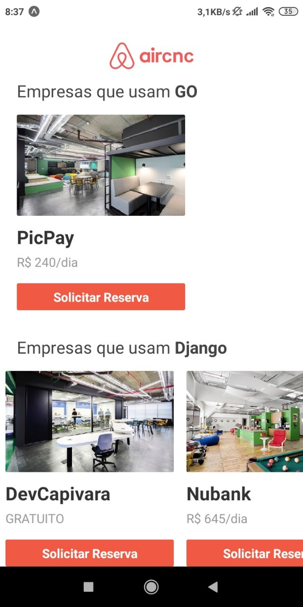
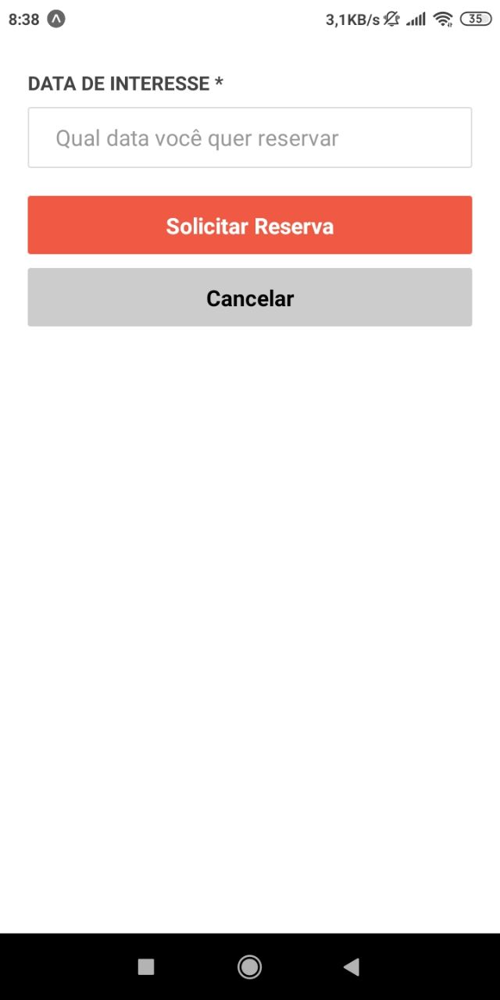
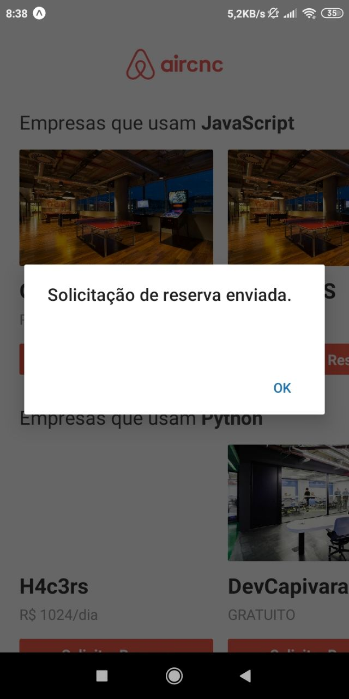

# AirCnc

## Descrição
        Projeto desenvolvido durante a semana omnistack 9 da rocketset. O objetivo era desenvolver uma plataforma onde empresesas oferecem spots e programadores solicitam uma reserva em spots que trabalhem com suas tecnólogias. Neste projeto foi desenvolvido:

        1. Back-End usando NodeJs
        2. Front-End usando ReactJs
        3. Mobile usando ReactNative

# Plataforma WEB(ReactJs)

# Aplicativo Mobile(ReactNative)

